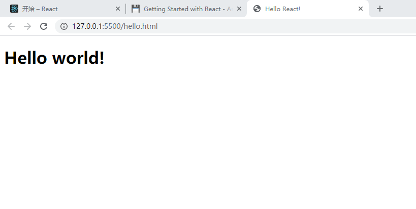

# React入门-概述和演练

英语好的直接看这里 -->[React入门-概述和演练教程](https://www.taniarascia.com/getting-started-with-react/)

让我先从静态index.html文件开始

---

**先决条件**：在开始使用React之前，您应该事先了解的一些事情。例如：如果您从未使用过JavaScript或HTML，那么在尝试解决React之前，你需要去了解他们。

在使用React之前，我觉得你需要了解一下几点

- 基本熟悉HTML和CSS。
- JavaScript和编程的基础知识。
- 对DOM有基本的理解。
- 熟悉ES6语法和功能。
- 全局安装了Node.js和npm。

**目标**：

- 了解基本的React概念和相关术语，例如Babel，Webpack，JSX，组件，道具，状态和生命周期。
- 构建一个非常简单的React应用程序，以演示上述概念。

这是最终结果的源代码和演示。

- [在GitHub上查看源代码](https://github.com/taniarascia/react-tutorial)
- [观看演示](https://taniarascia.github.io/react-tutorial/)

## 一、什么是React

- React是一个JavaScript库-最受欢迎的JavaScript库之一，[在GitHub上](https://github.com/facebook/react)有[超过100,000个星](https://github.com/facebook/react)。
- React不是一个框架（与Angular不同，后者更自以为是）。
- React是Facebook创建的一个开源项目。
- React用于在前端构建用户界面（UI）。
- React是MVC应用程序的**视图**层（模型视图控制器）

其中一个发生反应的最重要的方面是，你可以创建**组件**，这是一样的自定义，可重复使用的HTML元素，快速，高效地构建用户界面。React还使用**state**和**props**简化了数据的存储和处理方式。

在整篇文章中，我们将介绍所有这些内容以及更多内容，因此让我们开始吧。

安装与安装

有几种设置React的方法，我将向您展示两种，以便您很好地了解它的工作方式。

## 二、静态HTML文件

第一种方法不是设置React的流行方法，也不是本教程t其余部分的工作方式，但是如果您曾经使用过jQuery之类的库，它将是熟悉且易于理解的，如果您不熟悉Webpack，Babel和Node.js，那么这是最合适的入门方法。		

让我们开始制作一个基本`index.html`文件。

### 2.1. React开发依赖

开发React必须依赖三个库：

- react：包含react所必须的核心代码

- react-dom：react渲染在不同平台所需要的核心代码

- babel：将jsx转换成React代码的工具

  > 啥玩意？对于Vue来说，我们只是依赖一个vue.js文件即可，但是react居然要依赖三个库。

但是，这三个库是各司其职的，目的就是让每一个库只单纯做自己的事情：

- 在React的0.14版本之前是没有react-dom这个概念的，所有功能都包含在react里。
- 为什么要进行拆分呢？原因就是react-native。
- react包中包含了react和react-native所共同拥有的核心代码。
- react-dom针对web和native所完成的事情不同：

我们将在`index.html`中加载React，React DOM和Babel这三个CDN 。我们还将创建一个`<div id="root"></div>`标签，最后我们将创建一个`script`标签，您的自定义代码将在其中存在。

```HTML
<!-- index.html -->
<!DOCTYPE html>
<html>
  <head>
    <meta charset="utf-8" />
    <title>Hello React!</title>
    <!--React -React顶级API 包含react所必须的核心代码-->
    <script src="https://unpkg.com/react@^16/umd/react.production.min.js"></script>
    <!--React DOM -react渲染在不同平台所需要的核心代码-->
    <script src="https://unpkg.com/react-dom@16.13.0/umd/react-dom.production.min.js"></script>
    <!--Babel -将jsx转换成React代码的工具-->
    <script src="https://unpkg.com/babel-standalone@6.26.0/babel.js"></script>
  </head>
  <body>
    <div id="root"></div>
    <script type="text/babel">
      // React代码将会在这
    </script>
  </body>
</html>
```

我们应用程序的入口点将是`<div id="root"></div>`元素，该元素按惯例命名。您还会注意到`text/babel`脚本类型，这是使用Babel所必需的。

现在，让我们在`<script type="text/babel">`标签中编写React的第一个代码块。我们将使用ES6类创建一个称为React组件的`App`类。

```js
class App extends React.Component {
  //...
}
```

现在，我们添加[`render()`](https://reactjs.org/docs/react-component.html#render)方法，这是类组件中唯一需要的方法，用于呈现DOM节点。

```js
class App extends React.Component {
  render() {
      return (
          //...
      );
  }
}
```

在`return`中，我们将放置看起来像简单的HTML元素的内容。请注意，我们不在此处返回字符串，因此请勿在元素周围使用引号。这看起来像简单的HTML元素的内容被称为`JSX`，我们将很快对其进行详细了解。

```js + react
class App extends React.Component {
  render() {
    return <h1>Hello world!</h1>
  }
}
```

最后，我们将使用React DOM `render()`方法将`App`我们创建的类渲染到`root`HTML中的div中。

```js
ReactDOM.render(<App />, document.getElementById('root'))
```

这是我们的完整代码`index.html`。

```html
<!DOCTYPE html>
<html>
  <head>
    <meta charset="utf-8" />
    <title>Hello React!</title>

    <script src="https://unpkg.com/react@16/umd/react.development.js"></script>
    <script src="https://unpkg.com/react-dom@16/umd/react-dom.development.js"></script>
    <script src="https://unpkg.com/babel-standalone@6.26.0/babel.js"></script>
  </head>
  <body>
    <div id="root"></div>

    <script type="text/babel">
      class App extends React.Component {
        render() {
          return <h1>Hello world!</h1>
        }
      }
      ReactDOM.render(<App />, document.getElementById('root'))
    </script>
  </body>
</html>
```

现在，如果您在浏览器中查看`index.html`，您将看到我们创建的`h1`DOM 的标签。



惊！现在您已经完成了这一步，您可以看到React并没有那么让人着迷。只是一些JavaScript帮助程序库，我们可以将其加载到HTML中。

我们出于演示目的完成了此操作，但是从这里开始，我们将使用另一种方法：创建React App。
