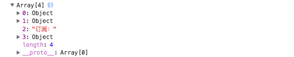

# props.children 和容器类组件

所有嵌套在组件中的 JSX 结构都可以在组件内部通过 `props.children` 获取到：

```jsx
// Card.jsx
class Card extends Component {
  render() {
    return (
      <div className="card">
        <div className="card-content">{this.props.children}</div>
      </div>
    );
  }
}

ReactDOM.render(
  <Card>
    <h2>React.js 小书</h2>
    <div>开源、免费、专业、简单</div>
    订阅：
    <input />
  </Card>,
  document.getElementById("root")
);
```

把 `props.children` 打印出来，你可以看到它其实是个数组：


React.js 就是把我们嵌套的 JSX 元素一个个都放到数组当中，然后通过 `props.children` 传给了 Card。

## 总结

使用自定义组件的时候，可以在其中嵌套 JSX 结构。嵌套的结构在组件内部都可以通过 `props.children` 获取到，这种组件编写方式在编写容器类型的组件当中非常有用。而在实际的 React.js 项目当中，我们几乎每天都需要用这种方式来编写组件。
