# manjaro KDE 的折腾记录

## 一、下载 manjaro 镜像

可以从[manjaro 官网](https://www.manjaro.org/)下载，或者从 [USTC 中科大](https://mirrors.ustc.edu.cn/manjaro-cd/)镜像下载几个主要版本

- Xfce 是一个用于类 UNIX 操作系统的轻量级桌面环境。它的目标是快速和系统资源低耗，同时仍然保持视觉上的吸引力和对用户友好的特性。推荐低配置的旧笔记本，安装这个版本。
- KDE 是一个功能丰富多样的桌面环境，提供几种不同风格的菜单来访问应用程序。还有一个优秀的内置界面，可以方便地访问、下载、安装新的主题、小部件等。 虽然在用户友好度上做的非常好，但 KDE 也是相当消耗系统资源的，跟 XFCE 比较起来，启动程序、使用桌面环境都明显偏慢。运行 Manjaro 的 64 位 KDE 桌面使用大约需要 550MB 的内存。我自己的就笔记本配置还可以，就安装了这个版本，确实很易用！
- GNOME 桌面环境是作为 GNU 项目的一部分来开发的，它旨在简单易用，并且完全可用。

## 二、使用[Rufus](http://rufus.ie/)制作启动盘

制作 U 盘启动盘,推荐使用[Rufus](http://rufus.ie/)

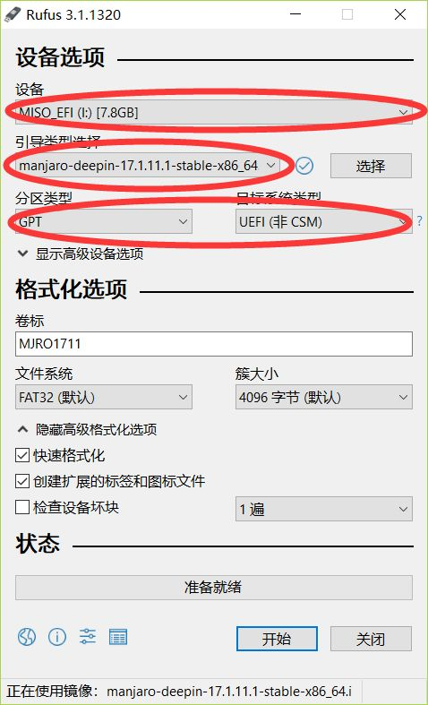

推荐使用 DD 写入，据说以 ISO 写入会无法安装，我没试，直接使用了 DD 镜像模式写入

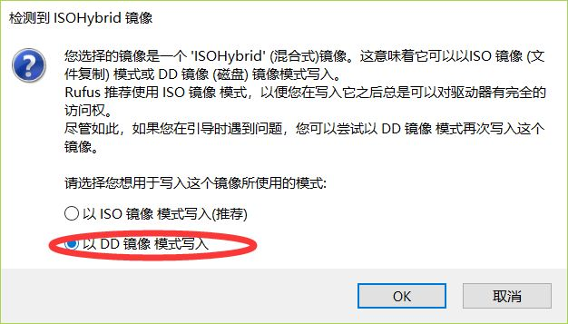

## 三、启动安装程序

重启，以 U 盘启动，U 盘启动的方式不同电脑各不相同，大体上都是改 BIOS 设置从 U 盘 启动

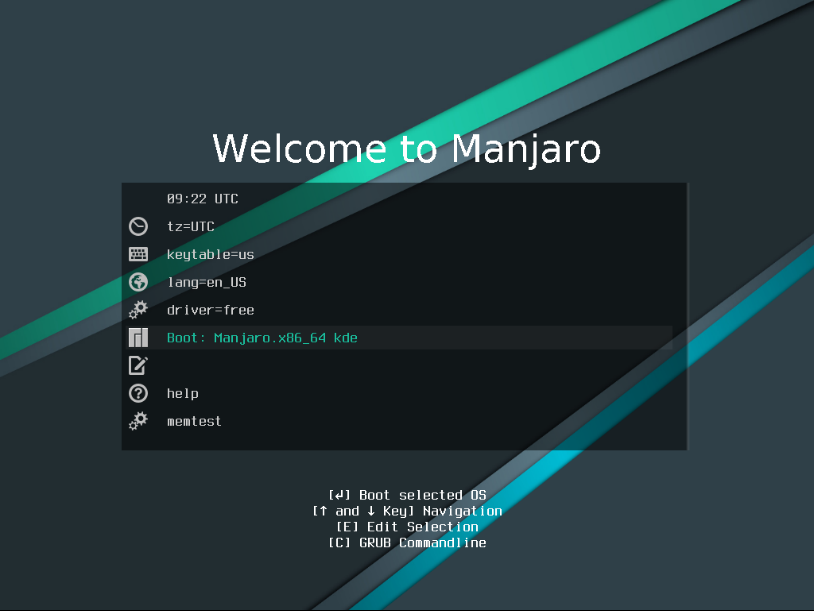

一段时间的等待之后进入欢迎页面可以切换为中文

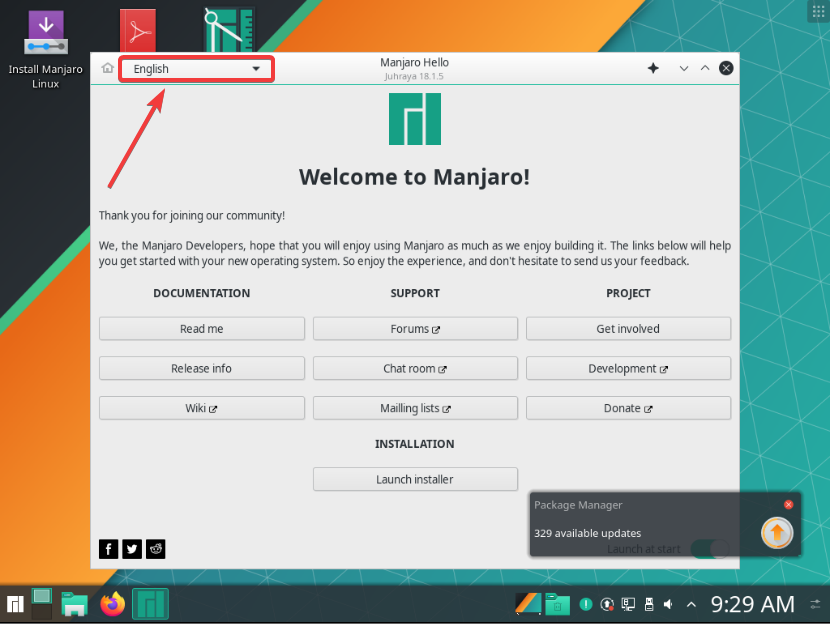

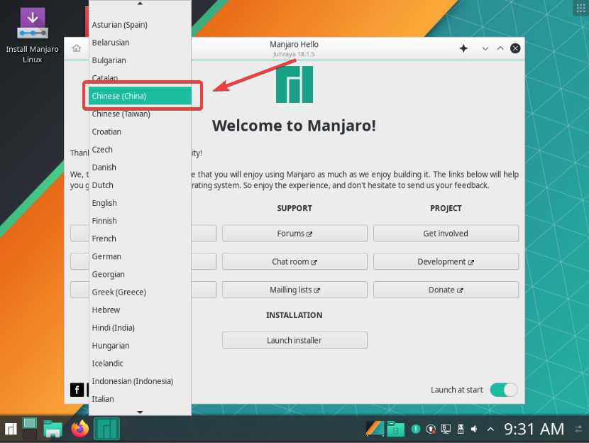

自此开始正式的安装步骤

#### 1-启动安装程序,下一步

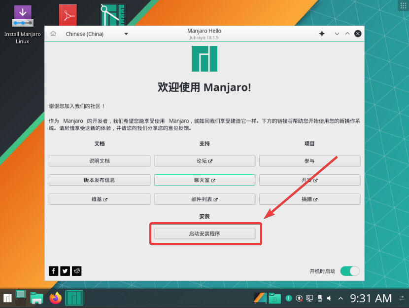

#### 2-选择语言,下一步

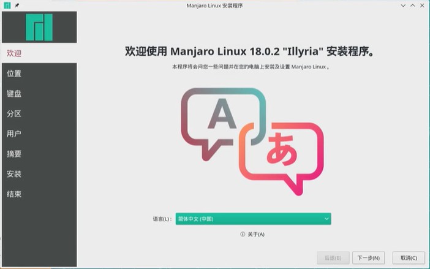

#### 3-选择上海(也就是选择时区),下一步

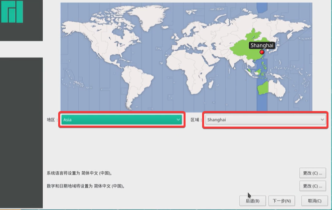

#### 4-选择键盘格式,下一步

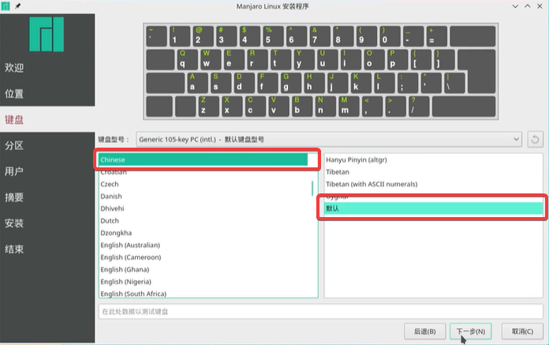

#### 5-抹除分区 

可以选择`抹除分区`,有经验的也可以选择`手动分区`，如果已有分区的磁盘还会多两个选项 : `取代一个分区`，`并存安装`

`抹除分区`会删除所有分区,并自动安装,这里我们选择`手动分区`，下一步

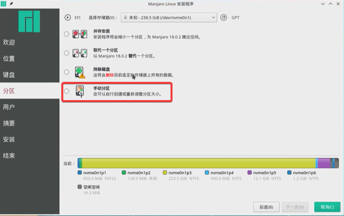

分区步骤

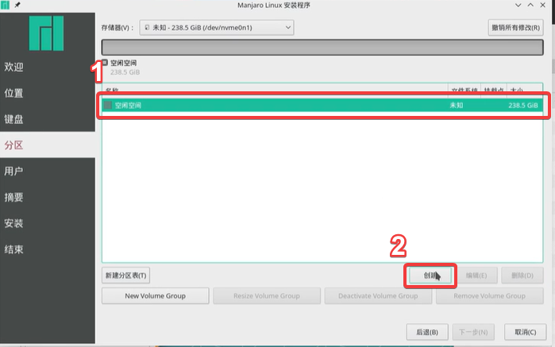

分区情况:

- efi 分区

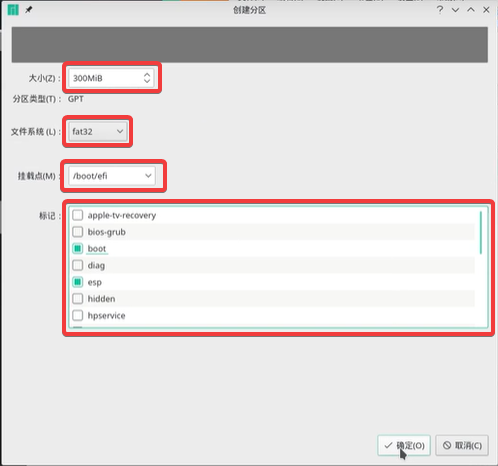

- opt 分区

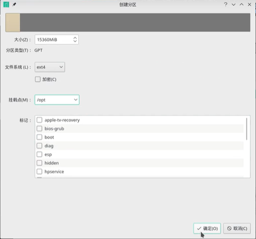

- / 根目录分区

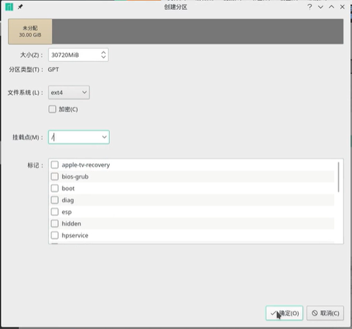

- swap 分区

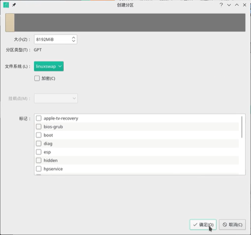

- home 分区

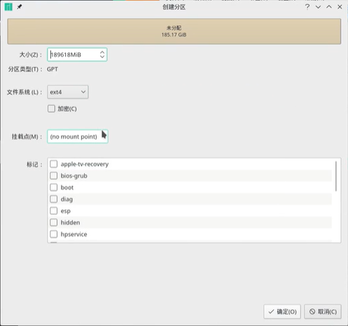

分区情况

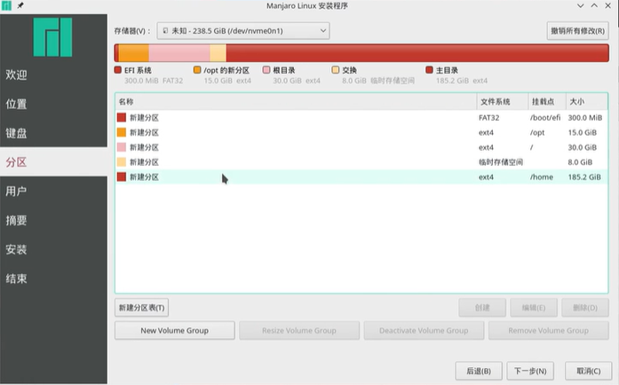

! 分区不一定要全部分配满,可以预留几十 G 的空闲分区不分配,方便后续增加需求

分区完成,下一步

#### 6-设置用户名、密码,下一步

#### 7-开始安装

配置结束,检查摘要信息,点击安装

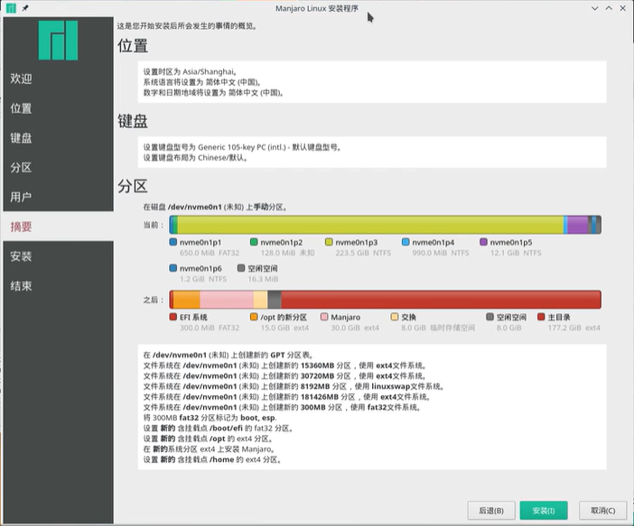

开始安装

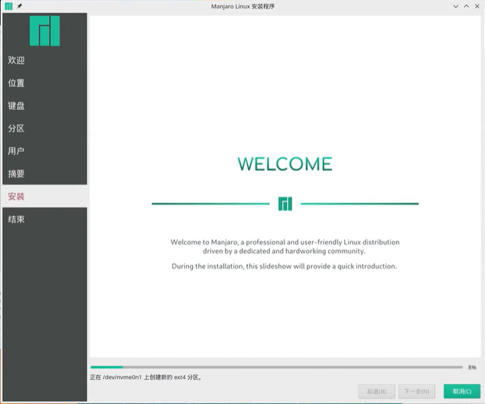