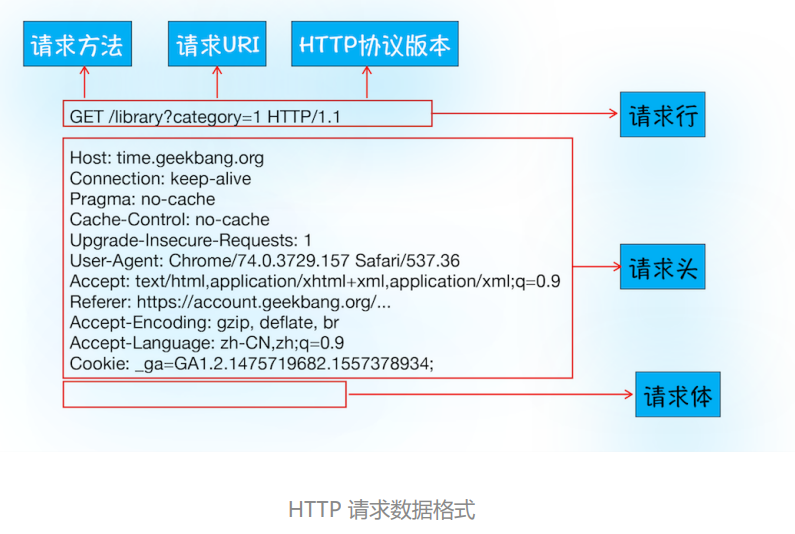

# 03 | HTTP请求流程：为什么很多站点第二次打开速度会很快？

## HTTP 协议

HTTP 协议，是建立在 TCP 连接基础之上的。**一种允许浏览器向服务器获取资 源的协议，是 Web 的基础**，通常由浏览器发起请求，用来获取HTML 文件、CSS 文件、JavaScript 文件、图片、视频等不同类型的文件。**HTTP 也是浏览器使用最广的协议**

## 浏览器端发起 HTTP 请求流程

你在浏览器地址栏里键入百度网站的地址：https://www.baidu.com/。

### 1.构建请求

首先，浏览器构建请求行信息。

```javascript
GET /index.html HTTP1.1
```

### 2.查找缓存

在真正发起网络请求之前，浏览器会先在浏览器缓存中查询是否有要请求的文件。如果有它会拦截请求，返回该资源的副本， 并**直接结束请求**，不会再去源服务器重新下载。

> 浏览器缓存是一种在本地保存资源副本，以供下次请求时直接使用的技术。

好处:

- 缓解服务器端压力，提升性能（获取资源的耗时更短了）；
- 对于网站来说，缓存是实现快速资源加载的重要组成部分。

如果缓存查找失败，进入网络请求过程。

### 3.准备 IP 地址和端口

浏览器使用**HTTP 协议作为应用层协议**，用来封装请求的文本信息；并使用 **TCP/IP 作传输层协议**将它发到网络上。

因此，浏览器需要在 HTTP 工作开始之前通过 TCP 与服务器建立连接。

**HTTP 的内容是通过 TCP 的传输数据阶段来实现的**


建立 TCP 连接的第一步需要 准备 IP 地址和端口号。

**域名解析：**百度网站的 IP 是 36.152.44.96, 难以记忆，但百度的域名（baidu.com）就好记多了，所以需要**“域名系统”**，简称 DNS （Domain Name System）负责把域名和 IP 地址做一一映射关系。

**第一步浏览器会请求 DNS 返回域名对应的 IP。**如果某个域名已经解析过了，浏览器还提供了 **DNS 数据缓存服务**，浏览器会缓存解析的结果，以供下次查询时直接使用，这样也会减少一次网络请求。

通常情况下，如果 URL 没有特别指明端口号，那 么 HTTP 协议默认是 80 端口。

### 4.等待 TCP 队列

拿到IP和端口后、还不能建立 TCP 连接。因为Chrome 同一个域名同时**最多只能建立 6 个 TCP 连接**

如果在同一个域名下同时有 10 个请求发生，那么其中 4 个请求会进入排队等待状态，直至进行 中的请求完成。

只有当前请求数量少于 6时，会直接进入下一步，建立 TCP 连接。

### 5. 建立 TCP 连接

在 HTTP 工作开始之前，浏览器通过 TCP 与服务器建立连接。[02  TCP协议：如何保证页面文件能被完整送达浏览器？.md](./02  TCP协议：如何保证页面文件能被完整送达浏览器？.md)

### 6. 发送 HTTP 请求

一旦建立了 TCP 连接，浏览器就可以和服务器进行通信了。而 HTTP 中的数据正是在这个通 信过程中传输的。



首先浏览器会向服务器发送请求行**（请求方法、请求 URI（Uniform Resource Identifier）、 HTTP 版本协议。）**

在浏览器发送请求行命令之后，还要以**请求头**形式发送其他一些信息，把浏览器的一些基础信 息告诉服务器。

比如包含了浏览器所使用的**操作系统、浏览器内核**等信息，以及**域名**、 **Cookie**等等。

## 服务器端处理 HTTP 请求流程

HTTP 的请求信息终于被送达了服务器。接下来，服务器会根据浏览器的请求 信息来准备相应的内容。

### 1. 返回请求

以通过工具软件 curl 来查看返回请 求数据

```shell
curl -I https://www.baidu.com/
```


先服务器会返回**响应行**，包括**协议版本**和**状态码**。

服务器会通过请求行的**状态码**来告诉浏览器它的处理结果。最常用的状态码是 **200**，表示处理成功； 如果没有找到页面，则会返回 **404**。

发送完响应头后，服务器就可以继续发送**响应体**的数据（HTML 、文本、JSON）等。

### 2. 断开连接

一旦服务器向客户端返回了请求数据，它就要关闭 TCP 连接。不过如果浏览器或者服务器在其头信息中加入了：

```shell
Connection:Keep-Alive
```

那么 TCP 连接在发送后将**仍然保持打开状态**，浏览器就可以继续通过同一个 TCP 连接发送请求，**以省去下次请求时需要建立连接的时间，提升资源加载速度。**

### 3. 重定向

如果，响应行返回的状态码是 301，状态 301 就是告诉浏览器，我需要重定向到另外一个网址。

---

## 1. 为什么很多站点第二次打开速度会很快？

主要原因是第一次加载页面过程中，缓存了一些耗时的数据（**DNS 缓存**和**页面资源缓存**）

浏览器是通过**响应 头中的 Cache-Control 字段**来设置是否缓存该资源。通常，我们需要通过 Cache-Control 中的 Max-age 参数来设为这个资源设置一个 缓存过期时长

```bash
Cache-Control:Max-age=2000
```

如果缓存过期了，浏览器则会继续发起网络请求，并且在**HTTP 请求头**中带上：

```bash
If-None-Match:"4f80f-13c-3a1xb12a"
```

服务器收到请求头后，会根据 **If-None-Match**的值来判断请求的资源是否有更新。

- 如果没有更新，就返回 304 状态码，相当于服务器告诉浏览器：“这个缓存可以继续使 用，这次就不重复发送数据给你了。”
-  如果资源有更新，服务器就直接返回最新资源给浏览器


