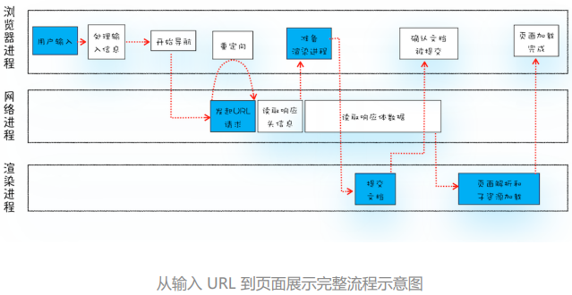

# 04 - 从输入URL到页面展示，这中间发生了什么？



从输入URL**到页面展示整个过程需要各个进程之间的配合**

- 浏览器进程：负责用户交互、子进程管理和文件储存等功能。

- 网络进程：面向渲染进程和浏览器进程等提供网络下载功能。

- 渲染进程：把从网络下载的 HTML、JavaScript、CSS、图片等资源解析为可以显示和交互的页面。

  因为渲染进程所有的内容都是通过网络获取的，会存在一些恶意代码利 用浏览器漏洞对系统进行攻击，所以运行在**渲染进程里面的代码是不被信任的**。因此为了保证系统的安全 Chrome 会让渲染进程运行在安全沙箱里

**完整的流程：**

- **输入URL** ：浏览器进程接收到用户输入的 URL 请求，将该 URL 转发给**网络进程**。
- **URL 请求**：
  - 网络进程中发起真正的 URL 请求。等待服务器响应
  - 网络进程接收到了响应头数据，便解析响应头数据，并将数据转发给**浏览器进程**。
- **响应数据类型处理**：浏览器进程接收到网络进程的响应头数据之后，发送 **“提交导航 (CommitNavigation)”**  消息到渲染进程；
- **准备渲染进程：**浏览器会根据当前页面决定是**分配新的渲染进程还是共用同一个渲染进程**
- **提交文档：**
  - 渲染进程接收到“提交导航”的消息之后，便开始准备接收 HTML 数据，接收数据的方式是直接和网络进程建立数据管道；
  - 最后渲染进程会向浏览器进程“确认提交”，这是告诉浏览器进程：“已经准备好接受和解 析页面数据了”。
- **渲染阶段：**浏览器进程接收到渲染进程“提交文档”的消息之后，便开始移除之前旧的文档，然后更新 浏览器进程中的页面状态。

### 1.输入URL

地址栏会判断输入的关键字是**搜索内容**，还是**请求的 URL。**如果判断输入内容符合 URL 规则，那么地址栏会根据规则加上**HTTP**或 **HTTPS**

> 浏览器还给了当前页面一次执行 beforeunload 事件的机会，beforeunload 事件允许页面在退出之前执行一些数据清理操作，可以通过 beforeunload 事件来取消导 航，让浏览器不再执行任何后续工作。

### 2. URL 请求过程

- 浏览器进程会**通过进程间通信（IPC）把 URL 请 求发送至网络进程**、
- **查找本地缓存**是否缓存了该资源。如果有缓存资源，那么直接返回资源给浏览器进程；

- 如果在缓存中没有该资源则**进行 DNS 解析获取请求域名的服务器 IP 地址。**
- **构建请求行、请求头**，后向服务器发送构建的请求信息。
- 服务器接收到请求信息后会**根据请求信息生成响应数据并发给网络进程**
- 等网络进程接收了响应行和响应头之后，就**开始解析响应头的内容**了。

### 3.响应数据类型处理

浏览器通过Content-Type来区分响应类型。**Content-Type 是 HTTP 响应头中一个非常重要的字段， 它告诉浏览器服务器返回的响应体数据是什么类型**

-  **Content-type:text/html：**是告诉浏览器，服 务器返回的数据是 **HTML 格式**。
-  **Content-Type:application/octet-stream：**浏览器会按照**下载类型**来处理该请求

> 如果服务器配置 Content-Type 不正确，比如将 text/html 类型配置成 application/octet-stream 类型，那么浏览器可能会曲解文件内容，将一个本来是用 来展示的页面，变成了一个下载文件。

如果 Content-Type 字段的值被浏 览器判断为**下载类型，那么该请求会被提交给浏览器的下载管理器，同时该 URL 请求的导航 流程就此结束。**

但如果是 HTML，那么浏览器则会继续进行导航流程。**准备渲染进程**。

### 4. 准备渲染进程

默认情况下，**Chrome 会为每个页面分配一个渲染进程**，但是，也有一些例外，[Chrome分配渲染进程策略](https://gitee.com/ChenYing1996/blogs/issues/I3QJNJ)

如果两个标签页属于同一站点 (相同协议、相同根域名)，那它们有可能共用同一个渲染进程。

**Chrome分配渲染进程的策略**：

- 如果两个标签页都**位于同一个浏览上下文组，且属于同一站点**，那么这两个标签页会被浏览器分配到同一个渲染进程中。
- 如果这两个条件不能同时满足，那么这两个标签页会分别使用不同的渲染进程来渲染

#### 浏览上下文组

浏览上下文就是一个标签页包含的内容，如window对象、历史记录、滚动条位置等。

```html
<a href="xxx" target="_black" class=""> 打开新标签 </a>
```

```javascript
window.open(xxx)
```

两个标签页是通过a标签或者js脚本的形式相互打开的，那这2个标签页我们可以说是有连接关系的。**他们之间都能通过 `opener` 来建立连接**，所以他们之间是有联系的。这一类有连接关系的标签页，称为**浏览上下文组**。

> 例外：如果a 链接的 rel 属性值都使用了 noopener 和 noreferrer，就是告诉浏览器通过这个链接打开的标签页中的 opener 值设置为 null，引入 noreferrer 是告诉浏览器，新打开的标签页不要有引用关系。也就是说，通过上述说法打开的新标签页不属于同一个浏览上下文中。
>
> ```html
> <a ref="noopener noopener" href="xxx" target="_black" class=""> 打开新标签 </a>
> ```

#### iframe分配渲染进程策略

 Chrome 浏览器已经默认实现了站点隔离的功能，这意味着标签页中的 iframe 也会遵守同一站点的分配原则。标签页中的 iframe 和标签页是同一站点，并且有连接关系，那么标签页依然会和当前标签页运行在同一个渲染进程中，如果 iframe 和标签页不属于同一站点，那么 iframe 会运行在单独的渲染进程中。

### 5. 提交文档

浏览器进程将网络进程接收到的 HTML 数据提交给渲染进程：

- 浏览器进程接收到网络进程的响应头数据之后，**向渲染进程发起“提交文档”的消息。**
- 渲染进程接收到“提交文档”的消息后，会**和网络进程建立传输数据的“管道”。**
- 等文档数据传输完成之后，渲染进程会**返回“确认提交”的消息给浏览器进程；**
- 浏览器进程在收到“确认提交”的消息后，会**更新浏览器界面状态**，包括了安全状态、地址 栏的 URL、前进后退的历史状态，并更新 Web 页面。

因此，在浏览器的地址栏里面输入了一个地址后，之前的页面没有立马消失，而是要加载一会儿**（URL 请求，响应数据解析，准备渲染进程，提交文档）**才会更新页面。

### 6. 渲染阶段

一旦文档被提交，渲染进程便开始页面解析和子资源加载了，一旦页面生成完成，渲染进程会发送一个消息给浏览器进程，浏览器接收到消息后，会停止标签图标上的加载动画。

## 总结

1. 服务器可以根据响应头来控制浏览器的行为，如跳转、网络数据类型判断。

2. Chrome 默认采用每个标签对应一个渲染进程，但是如果两个页面属于同一站点，那这两 个标签会使用同一个渲染进程。

3. 浏览器的导航过程涵盖了从用户发起请求到提交文档给渲染进程的中间所有阶段。

导航流程很重要，它是网络加载流程和渲染流程之间的一座桥梁


