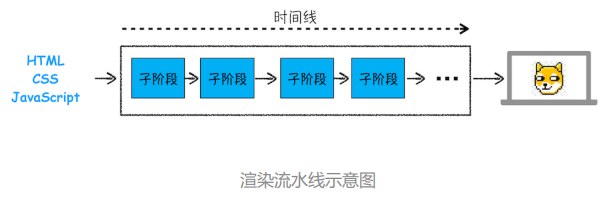
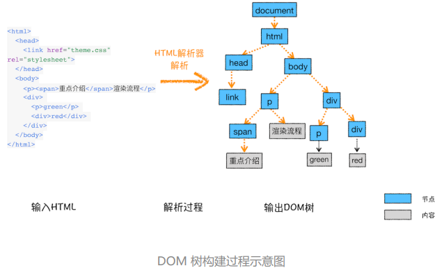
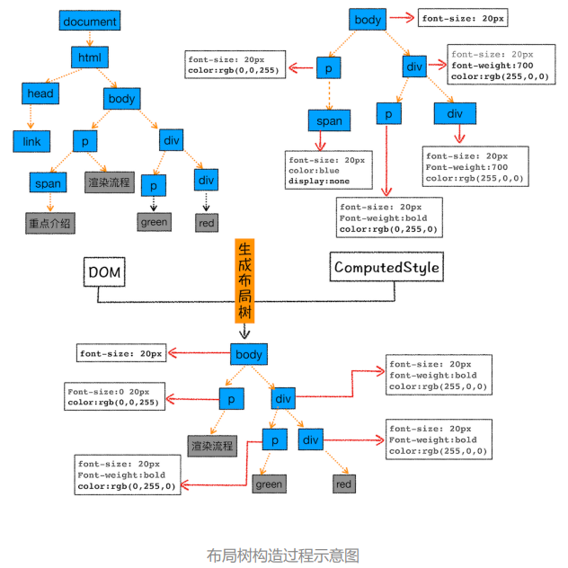
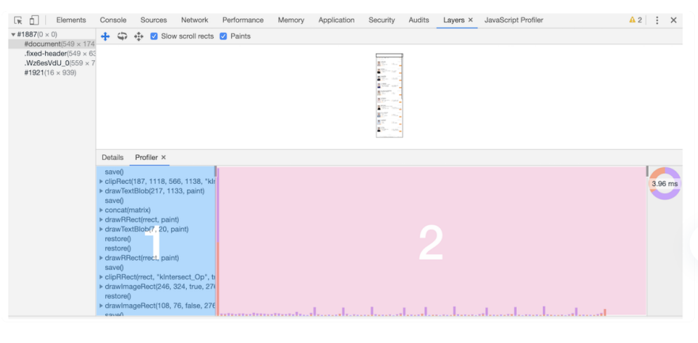
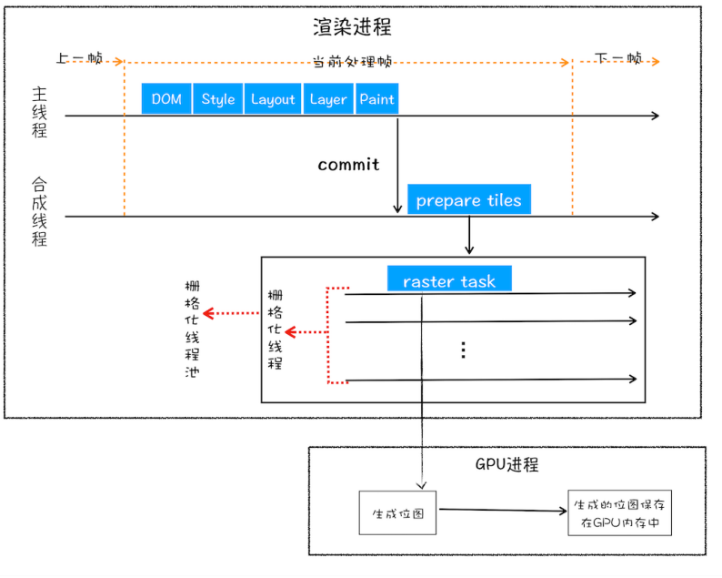
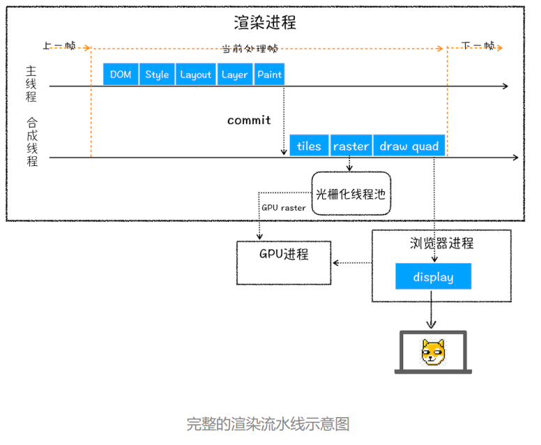

# 05 渲染流程：HTML、CSS和JavaScript，是如何变成页面的？


渲染模块在执行过程中会被划分为很多子阶段，输入的 HTML 经过这些子阶段，最后输出像素。我们把这样的一个处理流程叫做渲染流水线



流水线可分为如下几个子阶段：**构建 DOM 树、样式计算、布局阶段、 分层、绘制、分块、光栅化和合成**。

在每个阶段的过程中，每个子阶段都有其**输入的内容；处理过程；最终生成输出内容。**

## 构建 DOM 树

浏览器无法直接理解和使用 HTML，所以需要将 HTML 转换为浏览器能够理解的结构——DOM 树。



**输入内容：**`HTML 文件`，**处理过程：**经由 `HTML 解析器解析`，**输出：**最终输出`树状结构的 DOM`。

DOM 是保存在内存中树状结构，可以通过 JavaScript 来查询或修改其内容。

```javascript
document.getElementsByTagName("p")[0].innerText = "black"
```

## 样式计算（Recalculate Style）

### 1.CSS 转换

把 CSS 转换为浏览器能够理解的结构，当渲染引擎接收到 CSS 文本时，会将 CSS 文本转换为浏览器可以理解的结构—— **`styleSheets`**。

在 Chrome 控制台中 输入 `document.styleSheets`，就能看到


 ### 2.标准化

转换样式表中的属性值，使其标准化


2em 被解析成了 32px，red 被解析成了 rgb(255,0,0)，bold 被解析成了 700

### 3. 计算出 DOM 树中每个节点的具体样式

根据 **CSS 的继承规则和层叠规则**，计算 DOM 树中每个节点的样式属性


**输入内容：**CSS 文本；**处理：**属性值标准化，每个节点具体样式（继承、层叠、标准化）；**输出：**styleSheets(CSSOM)。

## 布局阶段

### 1.创建布局树

在显示之前，我们还要额外地构建一棵只包含可见元素布局树。排除使用了`display:none`一类属性的元素、以及如`head`一类不可见标签



DOM 树中所有不可见的节点都没有包含到布局树中。

- 遍历 DOM 树中的所有可见节点，并把这些节点加到布局树中；
- 而不可见的节点会被布局树忽略掉，如`head `标签下面的全部内容，再比如 `body.p.span` 这个元素，因为它的属性包含 `dispaly:none`，所以这个元素也没有被包进布局树。

**输入内容：**DOM & CSSOM ；**处理：**排除所有不可见的节点；**输出：**渲染树

### 2.布局计算

计算每个元素的几何坐标位置，并将这些信息保存在布局树 中。

> 在执行布局操作的时候，会把布局运算的结果重新写回布局树中，所以布局树既是输入内容也 是输出内容，这是布局阶段一个不合理的地方

## 分层

为了更加方便地实现一些复杂的 3D 变换、页面滚动，或者使用 z-indexing 做 z 轴排序等，**渲染引擎还需要为特定的节点生成专用的图层， 并生成一棵对应的图层树（LayerTree）。

Chrome 的“开发者工具”，更多工具，选择“Layers”标 签查看视化页面的分层情况：

**浏览器的页面实际上被分成了很多图层，这些图层叠加后合成了最终的页面**

并不是布局树的每个节点都包含一个图层，如果一个节点没有对应的层，那么这 个节点就从属于父节点的图层。

通常满足下面两点中任 意一点的元素就可以被提升为单独的一个图层。

- 第一点，拥有层叠上下文属性的元素会被提升为单独的一层。如：`position:fixed`、`z-index:2`、`filter:blue(5px)`、`opacity:0.5`
- 第二点，**需要剪裁（clip）的地方**也会被创建为图层、如果出现**滚动条**，滚动条 也会被提升为单独的层。

## 图层绘制

把一个图层的绘制拆分成很多小的**绘制指令**

打开“开发者工具”的“Layers”标签，选择“document”层，



区域 1 就是 document 的绘制列表，拖动区域 2 中的进度条可以重现列表的绘制 过程。

## 栅格化（raster）操作



绘制操作是由渲染引擎中的合成 线程来完成，当图层的绘制列表准备好之后，主线程会把该绘制列表提交（commit）给合成线程

**合成线程会将图层划分为图块（tile）**，这些图块的大小通常是 256x256 或 者 512x512，**合成线程会按照视口附近的图块来优先生成位图**，实际生成位图的操作是由栅格化来执行 的。所谓**栅格化，是指将图块转换为位图。**

栅格化过程都会**在GPU 进程中使用GPU 来加速生成**，使用 GPU 生成位图的过程叫快速栅格化，或者 GPU 栅格化，生成的位图被保存在 GPU 内存中。

## 合成和显示

一旦所有图块都被光栅化，合成线程就会**生成一个绘制图块的命令——“DrawQuad”**，然后将该命令提交给浏览器进程。

浏览器进程里面有一个叫 **viz 的组件**，**用来接收合成线程发过来的 DrawQuad 命令**，然后根据 DrawQuad 命令，将其页面内容绘制到内存中，最后再将内存显示在屏幕上。

## 总结

- 渲染进程将 HTML 内容转换为能够读懂的 **DOM 树**结构。
-  渲染引擎将 CSS 样式表转化为浏览器可以理解的 **styleSheets**，计算出 DOM 节点的样 式。
-  创建**布局树**，并计算元素的布局信息。
- 对布局树进行分层，并生成**分层树**。 
- 为每个图层生成**绘制列表**，并将其**提交到合成线程**。
- 合成线程**将图层分成图块**，并在**光栅化线程池**中将图块转换成位图。 
- 合成线程发送绘制图块命令 **DrawQuad** 给浏览器进程。
- 浏览器进程根据 DrawQuad 消息**生成页面，并显示到显示器上**。




