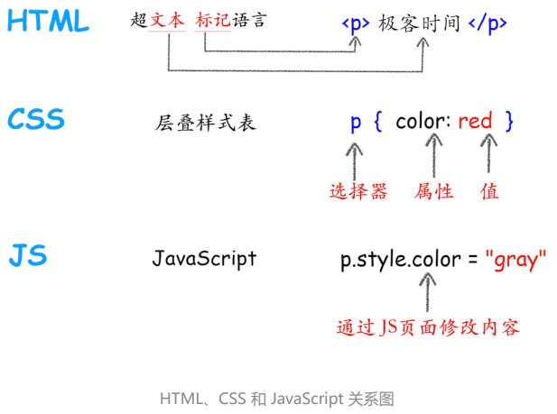
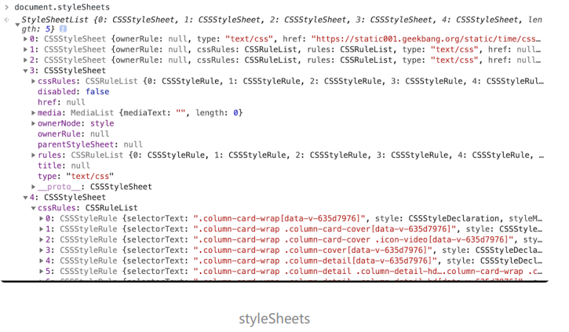
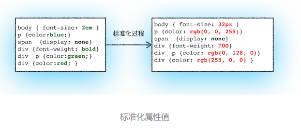
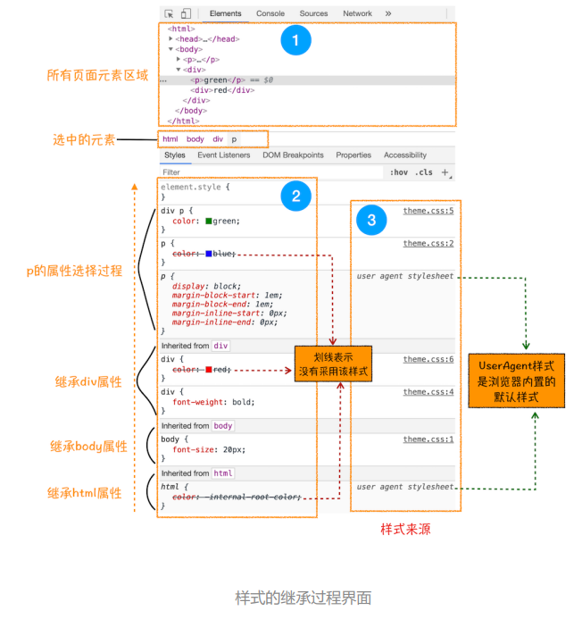

# 06 渲染流程：HTML、CSS和JavaScript，是如何变成页面的？



- **HTML：**由标记和文本组成。标记也称为标签，每个标签都有它自 己的语义
- **CSS ：**层叠样式表， 用来改变 HTML 的字体颜色、大小等信息
- **JavaScript：**它可以使网页的内容“动”起来，可以通 过 JavaScript 来修改 CSS 样式值，从而达到修改文本颜色的目的。

渲染模块在执行过程中会被划分为很多子阶段，输入的 HTML 经过这些子阶段，最后输出像素。我们把这样的一个处理流程叫做渲染流水线


流水线可分为如下几个子阶段：**构建 DOM 树、样式计算、布局阶段、 分层、绘制、分块、光栅化和合成**。

在每个阶段的过程中，**开始每个子阶段都有其输入的内容；然后每个子阶段有其处理过程；最终每个子阶段会生成输出内容。**

## 构建 DOM 树

浏览器无法直接理解和使用 HTML，所以需要将 HTML 转换为浏览器能够理解的结构——DOM 树。


输入内容：`HTML 文件`，处理过程：经由 `HTML 解析器解析`，输出：最终输出`树状结构的 DOM`。

打开 Chrome 的“开发者工具”，在控制台里面输入“document”后回车，就能看到一个完整 的 DOM 树结构，

DOM 是保存在内存中树状结构，可以通过 JavaScript 来查询或修改其内容。

```javascript
document.getElementsByTagName("p")[0].innerText = "black"
```

## 样式计算（Recalculate Style）

### 1.CSS 转换

把 CSS 转换为浏览器能够理解的结构，CSS 样式的来源：


CSS 样式来源主要有三种：**通过 link 引用的外部 CSS 文件**、**`<style>`标记内的 CSS**、**元素的 style 属性内嵌的 CSS**

当渲染引擎接收 到 CSS 文本时，会将 CSS 文本转换为浏览器可以理解的结构—— **`styleSheets`**。

在 Chrome 控制台中 输入 `document.styleSheets`，就能看到



 ### 2.标准化

转换样式表中的属性值，使其标准化



2em 被解析成了 32px，red 被解析成了 rgb(255,0,0)，bold 被解析成了 700

### 3. 计算出 DOM 树中每个节点的具体样式

根据 **CSS 的继承规则和层叠规则**，计算 DOM 树中每个节点的样式属性



## 布局阶段

在显示之前，我们还要额外地构建一棵只包含可见元素布局树。排除使用了`display:none`一类属性的元素、以及如`head`一类不可见标签


DOM 树中所有不可见的节点都没有包含到布局树中。

- 遍历 DOM 树中的所有可见节点，并把这些节点加到布局树中；
- 而不可见的节点会被布局树忽略掉，如`head `标签下面的全部内容，再比如 `body.p.span` 这个元素，因为它的属性包含 `dispaly:none`，所以这个元素也没有被包进布局树。


